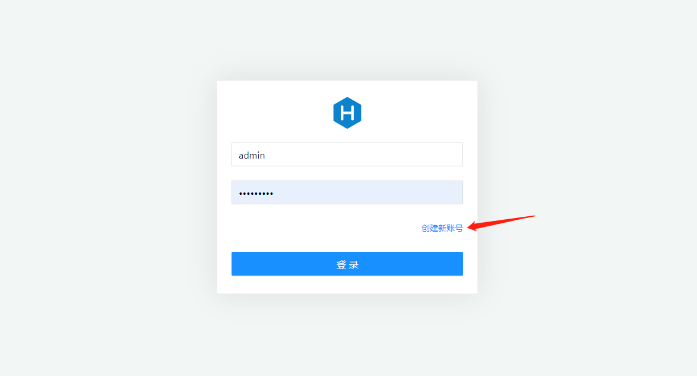

# hexo-admin-modern


An admin UI for the Hexo blog engine. Based off of the Ant-React Interface.

## Hexo Version

Use version `1.x` of this plugin only support Hexo version `5.x`

### Contents

- [**Screenshots**](#screenshots)
- [**Quickstart**](#quickstart)
- [**Credits**](#credits)

## Local use vs deployment

This plugin was originally designed as a local editor -- you run hexo locally, use `hexo-admin` to author posts, and then use `hexo generate` or `hexo deploy` to send the generated static HTML files up to github pages or some other static server.

However, `hexo-admin` can be run on your live blog, as long as you're using a non-static hosting service such as Heroku, DigitalOcean, AliCloud etc. Static hosting services such as Github pages and Surge.sh does not support running hexo-admin from your live site.

If you're using Hexo admin from your live blog, you should definitely **set up a password** ([see below](#4-password-protection)) -- otherwise anyone will be able to edit your content.

### Non-static hosting service

You can use PM2 to host serivce.

## Screenshots


## Quickstart

### 1. Setup hexo & create a blog

```sh
npm install -g hexo
cd ~/
hexo init my-blog
cd my-blog
npm install
```

### 2. Install the admin & start things up

```sh
npm install --save hexo-admin-modern
hexo server -d
open http://localhost:4000/admin/
```

### 3. Profit

The UI should be pretty discoverable -- let me know if you can't find something.

### 4. Password protection

If you're using Hexo admin on your live server, you want some password protection. To enable this, you just add a few config variables to your hexo `_config.yml`:

```yml
admin:
  username: myfavoritename
  password_hash: be121740bf988b2225a313fa1f107ca1
  secret: a secret something
```

The `password_hash` is the bcrypt hash of your password. The `secret` is used to make the cookies secure, so it's a good idea to have it be long and complicated.

**Generate your password config**:

A utility in Hexo admin's Settings can hash your password and generate the `admin` section for you.

1. Start Hexo and go to `Create new account` page.

1. Fill out your information. Copy the generated YAML into your `_config.yml`.


Once that's in place, start up your hexo server and going to `/admin/` will require you to enter your password.

### 5. Custom post metadata

To add and edit your own post metadata with the admin interface, add the metadata variable and your custom variables to your hexo `_config.yml`:

```yml
metadata:
  author_id: defaultAuthorId
  language:
```

You can provide default values that will be used to initialize the metadata of a new post. These can be either primitives or arrays.

## Contribute

- let me know how it can be improved in the [github issues](https://github.com/ChesterZengJian/hexo-admin-modern/issues)
- [fork](https://github.com/ChesterZengJian/hexo-admin-modern) and pull-request

## Credits

Built with ❤ by [ChesterZengJian](https://github.com/ChesterZengJian) using [React](http://facebook.github.io/react), [Ant Design of React](https://ant.design/docs/react/introduce), and [Less](http://lesscss.org).

## Thanks

Thanks to [Jared Forsyth](http://jaredly.github.io)([@jaredforsyth](http://twitter.com/jaredforsyth)) for [Hexo-Admin](https://github.com/jaredly/hexo-admin), this project is a reference to it.
